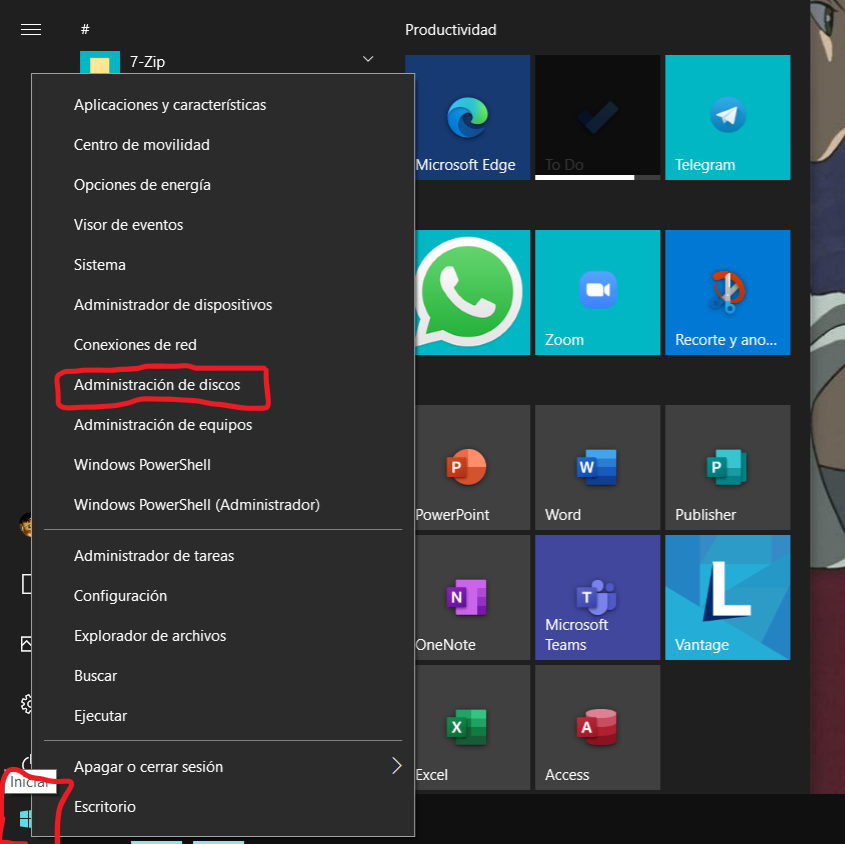
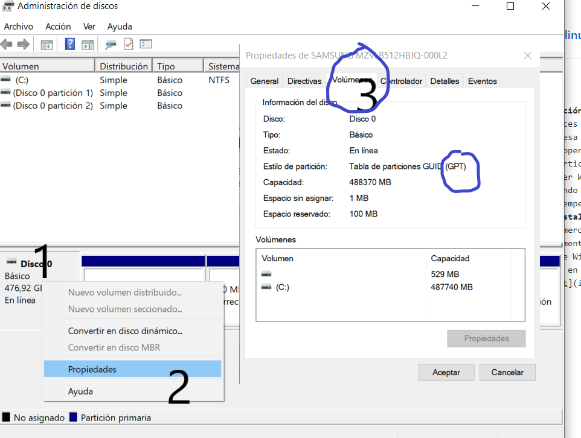
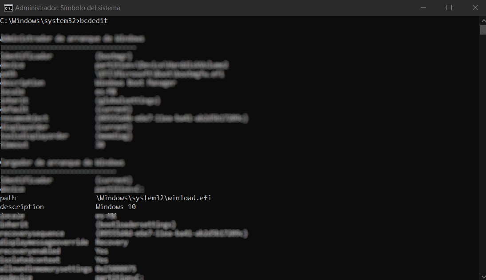

# Instalación de Gnu/Linux junto a Windows 10
Muchas veces cuando queremos aventurarnos en el mundo de Linux no queremos o no podemos dejar Windows atras, y esa es la razón de este articulo. La instalación de 2
sistemas operativos en un mismo disco le llamamos **DualBoot**, y es compatible con sistemas Windows :).
En este articulo voy a instalar el sistema operativo Arch Linux, junto a Windows 10. **Importante:** Debes tener Windows 10 ya instalado como sistema operativo, de manera que el Linux lo vamos a instalar como segundo sistema operativo. A continuación vamos a definir los requisitos o lo que debemos hacer antes de empezar:
## Pre Instalación
1. Lo primero que debemos hacer el comprobar que tenemos espacio suficiente en el disco, y posteriormente dejar el espacio libre para nuestro sistema Linux. Para hacer
esto desde Windows usamos el *Administrador de Discos*, el cual lo podemos encontrar dando clic izquierdo en el icono windows y ubicar Administrador de Discos.

Una vez dentro podemos ver el tipo de tabla de particiones, dando clic derecho, propiedades y volumenes. 

Si deseas saber si tu sistema es tipo UEFI o BIOS, en Windows puedes abrir la consola de comandos en modo administrador y ejecutar el siguiente comando: *bcdedit* donde sabrás si es UEFI o BIOS:

Una vez tenemos en cuenta todo esto, pasamos a dar un espacio en donde instalar Linux. Para esto vamos a abrir de nuevo el administrado de discos, en donde tenemos nuestro disco duro (normalmente llamado "C:"). Lo que debemos hacer es darle clic derecho a ese disco y seleccionar reducir volumen:

