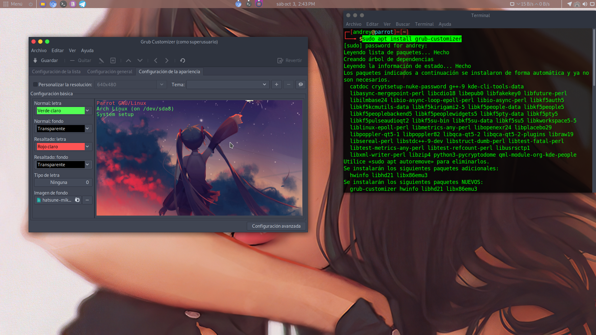
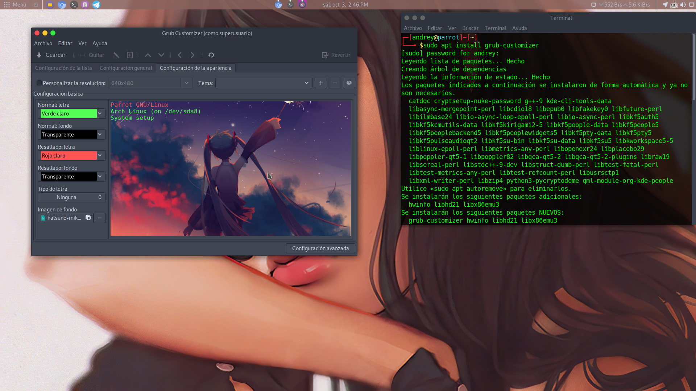
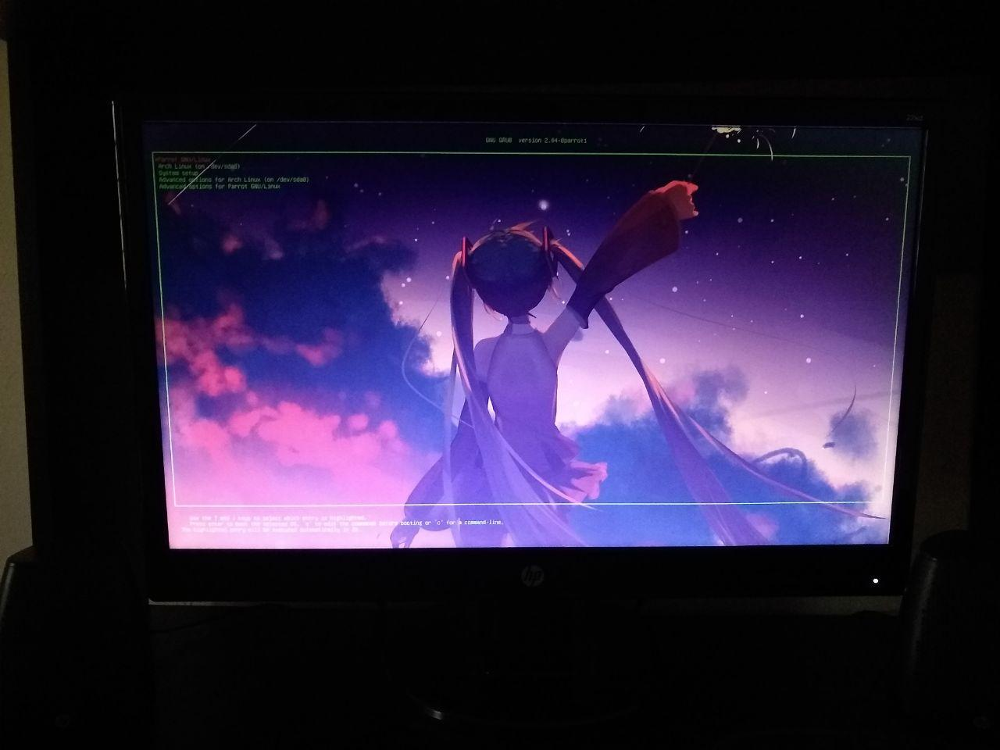

# Cambiando el estilo de nuestro cargador de arranque GRUB
Si eres usuario de Gnu/Linux, y utilizas GRUB como cargador de arranque, sabrás que el diseño o el estilo es horrible. Solo vemos una pantalla negra con letras blancas. En el día de hoy vamos a cambiar el diseño de nuestro cargador de arranque GRUB :slight_smile: .
Lo primero que necesitamos hacer es abrir nuestra terminal e instalar el paquete grub-customizer.
Una vez lo tengamos instalado lo podemos buscar en nuestro menú de aplicaciones, el nombre es el mismo. Lo abrimos y nos pedirá contraseña del usuario para poder aplicar los cambios. Una vez abierto debemos esperar a que carguen algunas cosas y luego tendremos un menú similar a este:

Ustedes lo tendran por defecto, pero en mi caso yo ya lo tengo editado.
Para cambiar la apariencia de nuestro GRUB debemos ir al apartado que dice: "Configuración de la apariencia", que está en las mini ventanas. Una vez dentro podremos escoger una imagen de fondo y cambiar el color de lo que nos sale, tal como el nombre de los sistemas operativos que tenemos instalados. Les recomiendo no cambiar el tipo de letra y su tamaño, porque a veces genera muchos problemas de apariencia y se verá algo desconfigurado. Una vez ustedes hayan puesto su imagen y su color, ya tendran que guardarlo y para esto le damos clic a la ventana que dice "Guardar". Una vez dado el clic empezará a cargar y guardar cambios, algo asi:

Cuando ya se les guarde por completo, pueden salirse y reiniciar el sistema para ver los cambios aplicados. La apariencia final quedaría asi:

Y ¡listo! ya tenemos nuestro arranque GRUB bonito. Aquí dejo una foto que he tomado de como ha quedado despues de reiniciar el computador.

