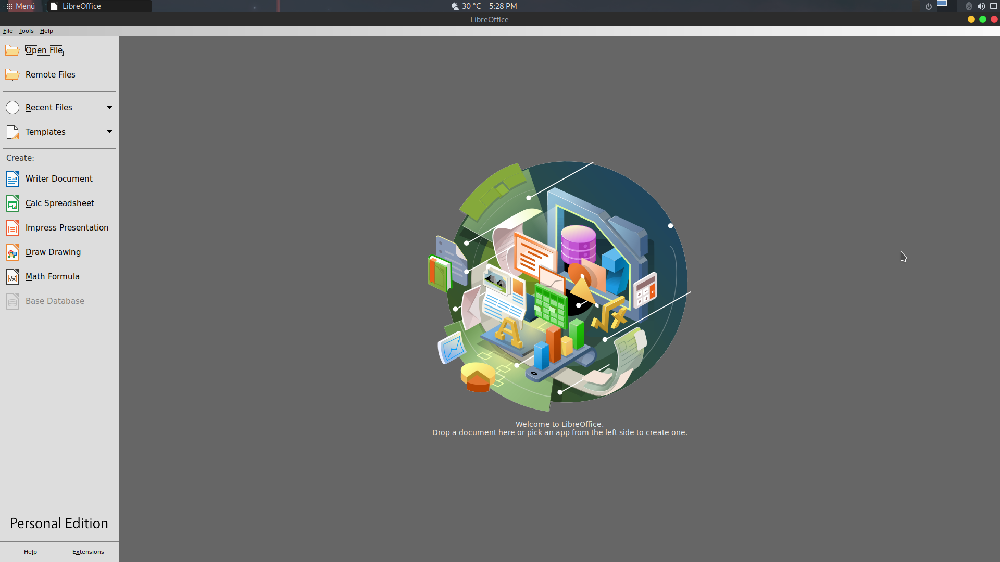

# Migrando a Parrot OS
Muchas veces los usuarios de Windows tienen miedo de migrar a otro sistema operativo, esto lo confirmo por
experiencia propia y más uno basado en Linux. Ese miedo aparece cuando se preguntan ¿Está esto en Linux?,
¿Cómo se hace esto en Linux?, etc. También puede presentarse el miedo de migrar a Linux por el tema de compatibilidad
de aplicaciones. Es verdad que ahora hay mucha variedad de aplicaciones que estan disponible en Linux, pero algunas como
juegos, editores, reproductores, entre otras, no lo estan. Afortunadamente en Linux contamos con muchisimo software libre
y de código abierto, los cuales podrían hacer la misma tarea que un software privativo de Windows o MacOS. En este post voy
a comentar de las aplicaciones esenciales en Linux para estudiantes, profesores y demás. He recopilado estas aplicaciones
buscando lo que todo usuario necesita en su día a día.

Antes de empezar quiero aclarar que todas las aplicaciones que se verán acontinuación, en su mayoría estan disponibles e instaladas en Parrot OS.

## **Antivirus**
Los sistemas operativos basados en Linux tienen menos probabilidad de adquirir un virus, esto es debido a que el "objetivo" de la mayoría de
los malwares estan dedicados para microsoft Windows. Esto es porque hay muchas más computadoras que usan Windows y no Linux. Esto no quiere
decir que Linux no está expuesto, lo que pasa es que la arquitectura de los sistemas operativos basados en Linux es diferente a sistemas como
Windows. Linux es mucho más robusto que Windows en el tema de obtener privilegios, en Linux cualquier cosa que no tenga que ver con la configuración
un usuario, es decir, cualquier configuración o modificación que se quiera hacer al propio sistema, se debe tener permisos de root (superusuario).
En Linux se mantiene seguro un sistema al estar siempre actualizado y descargar software desde los repositorios del propio sistema. Aquí el antivirus
eres tú.
## **Navegador Web**
La mayoría de nuestro tiempo frente al ordenador la pasamos en un navegador web, de los navegadores no tenemos que preocuparnos
debido a que estos estan disponibles en casi todos los sistemas operativos que existen hasta ahora. Parrot OS viene con Firefox instalado.
En caso de que queramos usar otro navegador tal como Chromium, lo podemos instalar desde los repositorios o desde un software de instalación
gráfico tal como Synaptic.

## **Ofimática**
Cuando nos referimos al tema de ofimática, estamos hablando de un conjunto de herramientas que nos permiten hacer trabajo de oficina. La suite ofimática más conocida es Microsoft Office la cual viene integrada de microsoft Windows, pero debes pagar la licencia una vez esta expire. Si estas pensando en migrar a Linux e ir por Parrot OS, no te preocupes. Parrot OS trae por instalado la suite de Libre Office, la cual te puede ofrecer todo lo que necesites. Una dato interesante es que desde LibreOffice Writer podemos convertir directamente a formato PDF.A contunuación se describen las herramientas que trae Libre Office que remplazan las de Microsoft Office. [Acerca de Libre Office](https://es.libreoffice.org/)
1. **LibreOffice Writer**
Writer tiene todas las características que necesitas de una herramienta moderna, con todas las funciones de procesamiento de textos y autoedición.
Esta herramienta es una muy buena opción a Microsoft Word. Aparte, un dato que he descubierto al usarla es que podemos convertir nuestro documento a version PDF con facilidad. [Acerca de Writer](https://es.libreoffice.org/descubre/writer/)
2. **LibreOffice Impress**
Impress es una herramienta verdaderamente excepcional para crear presentaciones multimedia efectivas. Es una opción muy buena y completa para Microsoft PowerPoint. [Acerca de Impress](https://es.libreoffice.org/descubre/impress/)
3. **LibreOffice Calc**
Esta es una herramienta que nos permite hacer cálculos tal como vendría siendo Microsoft Excel, puedes hacer las mismas cosas, mismos cálculos y obtener los mismos resultados. [Acerca de Calc](https://es.libreoffice.org/descubre/calc/)
4. **LibreOffice Math**
Math es el editor de fórmulas de la suite LibreOffice, que se puede invocar en tus documentos de texto, hojas de cálculo, presentaciones y dibujos, para que puedas insertar fórmulas matemáticas y científicas con formato perfecto. [Acerca de Math](https://es.libreoffice.org/descubre/math/)
5. **LibreOffice Draw**
Draw te permite crear cualquier cosa, desde un boceto rápido a un complejo plan, y te da los medios para comunicar con gráficos y diagramas. [Acerca de Draw](https://es.libreoffice.org/descubre/draw/)

Ahora que sabes las diferentes opciones que tienes al usar Libre Office,te preguntarás ¿Quiénes usan esto?. Es una pregunta valida ya que a veces nos da desconfianza, tu respuesta está aquí [Clic](https://es.libreoffice.org/descubre/calc/)

## **Descompresor**
Una herramienta para comprimir y descomprimir archivos es esencial en todo sistema, en Linux existen muchas de manera grafica y por consola, Parrot OS viene con ambas (por línea de comandos y entorno grafico). **Gestor de archivadores Engrampa** es la herramienta grafica que podemos utilizar para descomprimir archivos comprimidos. Esta soporta todos, desde .7z hasta .gz.

## **Editor de fotografías e imágenes**
En sistemas como Windows y MacOS tenemos la posibilidad de instalar herramientas como **Photoshop**. En Linux también tenemos una muy buena y completa herramienta para la edición de fotos. **Gimp** es una herramienta para la manipulación de imágenes y es multiplataforma, es decir que la puedes usar en Windows, MacOS y Linux. Si tu te dedicas a la pintura digital tienes la posibilidad de usar [Krita](https://krita.org/en/), una poderosa herramienta para la pintura digital. Parrot OS no trae instalado Krita por defecto, pero su instalación es muy sencilla: 
1. Abres la terminal
2. Actualizas el sistema con los comandos: `` sudo apt upgrade ``
3. Como paso final vamos a instalarla desde los repositorios con ``sudo apt install krita``
## Krita

## Gimp

## **Lector de PDFs**
Parrot OS viene con un visor de PDFs muy completo el cual es **visor de documentos atril**, cuenta con una interfaz sencilla y personalizable. También es posible abrir un documento PDF usando LibreOffice Draw.

## **Gestor de torrents**
El gestor de torrents más conocido por lo usuarios de sistemas como Windows es UTorrent, en Linux contamos con uno bastante completo (experiencia propia) el cual es **QBittorrent**. En Parrot OS este ya viene instalado y listo para usar.

## **Reproductor de vídeo**
El reproductor de vídeo y audio por excelencia tanto para usuarios de Windows como Linux, es **VLC**. El cual es una plataforma de multimedia libre y de código abierto. Dentro de Parrot OS ya viene instalada. Adicionalmente también viene con otro reproductor de multimedia muy poderoso, lo encontramos como **mpv Media Player** en el menu.

## **Redes sociales**
No muchas aplicaciones como Facebook, Whatsapp o Messenger están disponibles nativamente para Linux. Hay versiones para Linux pero no son un producto oficial y tampoco tienen soporte oficial por parte de Facebook. Para usar estas podemos hacerlo tranquilamente en el navegador. Las aplicaciones de mensajeria disponibles en Linux son bastantes buenas también, de las más conocidas tenemos la posibilidad de usar Telegram,Slack y Skype. Contamos con Telegram en los repositorios de Parrot OS y lo podemos instalar de la siguiente manera:
1. Abres la terminal 
2. Actualizas con: ``sudo apt upgrade``
3. Ejecutas el siguiente comando: ``sudo apt install telegram-desktop``

Las demás aplicaciones las podemos instalar desde su página oficial. La instalación de estas se va a cubrir en otro post (despues de este), por lo que los invito a que esten pendientes.
## **Juegos**
¿Podemos jugar en Linux? Por supuesto que si. No existe la misma compatibilidad así como en Windows o MacOS, pero podemos jugar. En Linux tenemos la posibilidad de instalar Steam, una plataforma de videojuegos. No está en los repositorios de Parrot OS pero podemos descargar e instalar, y como ya habia mencionado, se cubrirá en un post futuro. Si te gustan los juegos de estrategia, en los repositorios de Parrot OS se encuentra el juego **0ad**, un juego de estrategia en tiempo real. Podemos instalarlo de la siguiente manera:
1. Abre la terminal
2. Actualizas con: ``sudo apt upgrade``
3. Ejecutas el siguiente comando: ``sudo apt install 0ad``
4. Jugar y disfrutarlo

Puedes obtener más información del juego aquí en su página oficial [0Ad](https://play0ad.com/)
## **Desarollo de aplicaciones**
Si eres un programador o un estudiante y quieres ver que hay en linux para hacerlo, dejame decirte que en Linux hay variedad de todo. Puedes usar Visual Studio Code, el cual es muy bueno y usado. Sin embargo en Parrot OS viene instalado un software que es como el Visual Code pero con la diferencia de que este no rastrea tus datos. Puedes ver más en [Vscodium](https://itsfoss.com/vscodium/).También hay opciones como **Geany** el cual es un IDE ligero y viene instalado en Parrot OS.

  

## **Edición de vídeos**
En Linux contamos con un potente editor de vídeo no lineal llamado **Kdenlive**. Este editor no tiene nada que envidiar de otros, es muy completo y estable. El que sea no lineal significa que es muy eficaz y poderoso. Puedes ver más aquí [Kdenlive](https://kdenlive.org/es/acerca-de/).Este software no viene instalado por defecto en Parrot OS, pero si está disponible en los repositorios, para instalarlo vamos a hacer lo siguiente:
1. Abre la terminal
2. Actualizas con: ``sudo apt upgrade``
3. Ejecutas el siguiente comando: ``sudo apt install kdenlive``
#

## Conclusión
En Linux tenemos la solución a casi cualquier problema, por no decir todos. Si tienes miedo, te invito a que pruebes un sistema,recomendado empezar con Parrot OS, en modo **live**. Este modo te permite probar el sistema sin necesidad de instalarlo en tu disco duro. También puedes usar un software de virtualización que te permita usar un sistema como máquina virtual. Mira [VirtualBox](https://www.virtualbox.org/).

No tengas miedo de migrar a otro sistema. Esto es parecido a un estilo de vida, cuando lo cambias no estas dejando tu vida atras, la estás actualizando y mejorando, estás descubriendo nuevos mundos y es allí donde tus gustos que no sabias que tenias, aparecen.

Hemos llegado al final de este post, si llegas a tener alguna duda, problema o sugerencia, puedes comunicarla en el grupo de Parrot OS en Telegram.
#
Grupo de Parrot OS: https://t.me/ParrotSpanishGroup

Grupo de Parrot OS School: https://t.me/ParrotSecSchool