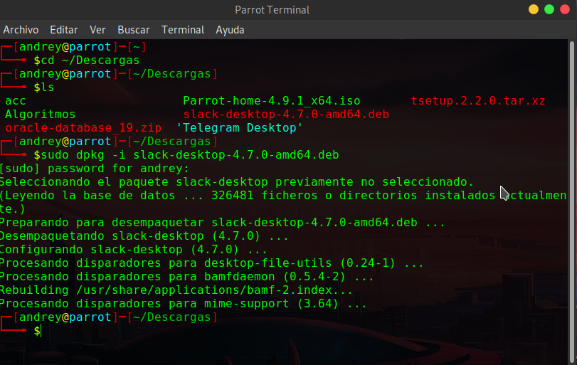
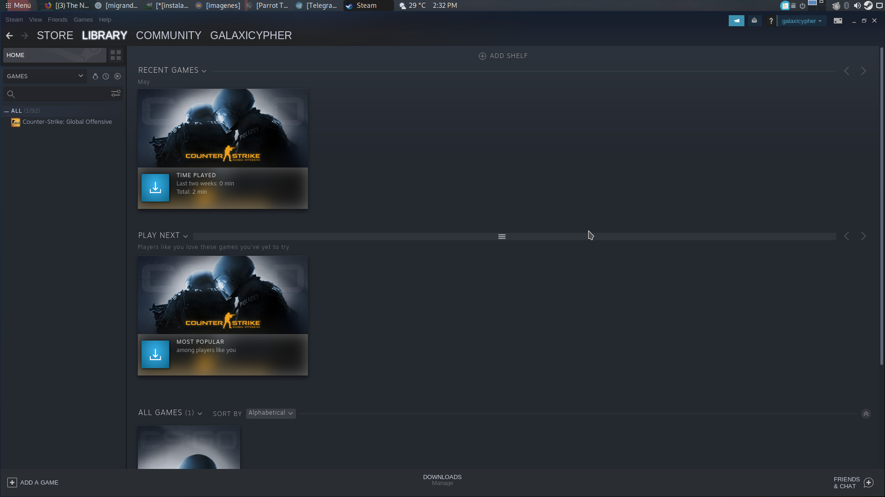

# Migrando a Parrot OS II
Hay veces en las que hay aplicaciones disponibles para Linux, pero no estan en los repositorios de nuestro sistema, entonces... ¿Cómo las podemos instalar?. El procedimiento es facil, no se necesita tener conocimientos avanzados. En este post vamos a instalar aplicaciones que vienen en extención ".deb". Antes de iniciar hay que dejar claro que ".deb" quiere decir que es para sistemas Debian. Parrot OS es un sistema operativo basado en Gnu/Linux Debian, por lo que esos paquetes son compatibles para nosotros. En este post vamos a usar unos cuantos comandos en la consola, si aún no tienes conocimiento alguno de esto no te preocupes, en estos momentos se estan haciendo vídeos muy buenos en el canal de Parrot OS, en el cual aprenderás todo acerca de la línea de comandos. [Canal Parrot OS School](https://www.youtube.com/channel/UCyIDFTGALbem6w74_8dPDxg). También contamos con una Academia de Ciber Seguridad muy buena, la cual tiene un curso gratuito sobre Linux Essential. [CS-Academy](https://class.cs-academy.org/). Ahora ¡Empecemos!

Las aplicaciones que vamos a instalar en el día de hoy son: Telegram, Slack y Steam.

## Telegram
Telegram es una plataforma de mensajería y VOIP. La aplicación está enfocada en la mensajería instantánea, el envío de varios archivos y la comunicación en masa. [Saber más](https://telegram.org/).

Vamos a ir a la página oficial de Telegram, vamos a entrar a donde dice **Telegram for PC/MAC/LINUX** y nos llevará a este [link](https://desktop.telegram.org/). Vamos a darle a la opción **Show all platforms** y posteriormente vamos a elegir Linux de 64 bits (32 bits en caso de que tu sistema sea de 32 bits). Se nos va a descargar un archivo llamado *tsetup.2.2.0.tar.xz*. El número de versión va a depender el día en que esten viendo este post y la versión en la que esté Telegram. Una vez tengamos el archivo vamos a descomprimirlo, podemos hacer uso de la aplicació **Engrampa** la cual vimos en el post de Migrando a Parrot [ver](https://github.com/Andrey-0/posts/blob/master/migrando1.md#descompresor).

1. Vamos a abrir nuestra aplicación Engrampa e iremos a la opción *abrir*. Vamos a seleccionar en donde se guardó nuestra descarga.
2. Una vez abierto el archivo descargado de Telegram, podemos ver que contiene una carpeta llamada *Telegram*. Vamos a darle en *extraer* y seleccionar una ruta. Pueden usar la ruta *mi carpeta personal*. Por ultimo presionamos en la parte de abajo el botón *Extraer*.
3. Una vez termine el programa, este nos avisará. Solo debemos darle a cerrar.
4. Nos vamos a dirigir a la carpeta en la que lo descomprimimos,y vamos a entrar en ella. Una vez dentro vamos a dar doble clic al archivo llamado *Telegram*.

Ahora solo debes poner tu cuenta y listo. Ten en cuenta que cuando Telegram actualice no lo va a hacer desde los repositorios, te va a salir una ventana que dice algo como *actualizar* dentro de Telegram. Cuando eso pase solo de las actualizar y listo. 

Las cosas que descargues desde Telegram se van a guardar automaticamente en una carpeta llamada *Telegram Desktop*, ubicada en tu carpeta de descargas.

## Slack
Slack es una herramienta de comunicación en equipo que ha venido siendo usada por muchas empresas estos ultimos meses, esto por la crisis del Covid19 que se ha presentado.

Lo que primero debemos hacer es ir a la página de descargas de Slack, en el apartado de aplicación para Linux: [link](https://slack.com/intl/en-co/downloads/linux). Vamos a elegir nuestro paquete ".deb" y lo descargamos

Ahora vamos a proceder a abrir la termial del sistema, van hacia el menú y buscan *terminal* o *konsole* en caso de estar en KDE. Sabemos que descargamos en archivo de Slack en la carpeta descargas, bien, ahora debemos ir hacia ella y ejecutar ese archivo, pero desde la terminal. No tengas miedo, estos comandos son básicos y no van a dañar tu computadora. Los comandos que vas a ejecutar son los siguientes (suponiendo que tienes tu sistema en español, sino solo cambia el nombre de la carpeta a ingles)

1. *cd ~/Descargas* 

Con esto nos movemos a la carpeta Descargas en nuestra carpeta personal

2. *ls* 

Listamos el contenido y podemos ver nuestro archivo de Slack

3. *sudo dpkg -i slack-desktop-4.7.0-amd64.deb*

El nombre de nuestro archivo puede variar según la versión que hayamos descargado, tu pon el nombre de tu archivo. Esto lo que hará es ejecutar ese ".deb" e instalar lo que trae dentro.

Una vez realizado esto, ya tenemos slack instalado. Puede que lo busques en el menú y que no esté allí. Es normal, solo reinicia el sistema y ya estará. También puedes ejecutar Slack desde tu terminal, esto para ver si tu instalación fue exitosa. No se preocupen por las líneas que les saldrán, solo se está ejecutando, es normal.

Listo. Ya tenemos Slack instalado, ahora solo debes conectarte a tu espacio de trabajo y esto estará funcionando bien.

## Steam
Steam es una muy buena plataforma de vídeo juegos y afortunadamente tiene juegos disponibles para Linux. Juegos tales como: Dota, CSGO, Ark, Terraria y otros. Puedes verlos [aquí](https://store.steampowered.com/linux).

Lo que tenemos que hacer es ir a la página oficial de Steam y darle en instalar, una vez estemos allí vamos a seleccionar el icono de Steam:

Una vez le damos allí, se nos va a generar un archivo llamado (en mi caso) *steam_lastet.deb*. La instalación es igual a como lo hicimos con Slack, debemos hacer uso de *dpkg -i*. Ten en cuenta que esa "i" hace referencia a "install".

Una vez tengamos el archivo descargado vamos a abrir una terminal y vamos a ejecutar los siguientes comandos:

1. Vamos a ir a la carpeta donde lo descargamos, en este caso la mia es Descargas

*cd ~/Descargas*

2. Puedes listar con *ls* y mirar que tenemos el archivo. Vamos a proceder a instalarlo.

*sudo dpkg -i steam_lastet.deb*

Ten en cuenta que tu archivo puede tener otro nombre, solo pon el nombre que tienes tú. Cuando lo ejecutas te pide una contraseña, pon la de tu usuario.

Una vez lo tengamos vamos a ir al menú y ejecutarlo. Puede ser que la aplicación necesite permisos de sudo para instalar paquetes o librerias que necesite, como lo es en mi caso. Solo debes poner tu contraseña y estas se instalarán.

Posteriormente te va a salir algo de que se van a instalar esas librerias, solo debes escribir como te indica la consola, en mi caso debo poner *S*

Una vez se hayan descargado ya podríamos iniciar Steam sin ningún problema. 

Sin embargo, si se te presentó algún problema al instalar estas librerias mediante ese instalado de Steam, puedes instalarlas tu mismo. Vamos a ver como es. *Librerias que se necesitan:     libgl1-mesa-dri:i386, libgl1:i386, libc6:i386
*

Abre la terminal y ejecuta el siguiente comando.

*sudo apt install libgl1-mesa-dri:i386 libgl1:i386 libc6:i386*

Si hay problemas de repositorios, red u otra cosa, puede que te salga un mensaje parecido a este:

Solo debemos hacer lo que nos pide, ejecutar el mismo comando pero agregando unos cuantos parametros.

*sudo apt install libgl1-mesa-dri:i386 libgl1:i386 libc6:i386 --fix-missing*

Una vez lo hagamos tendremos instaladas las librerias. Si no las pudiste instalar y tal vez te salen más errores, puedes ejecutar

 *sudo apt -f install*

 El cual te ayudará con problemas de dependencias. Si tienes algún otro problema puedes acudir al grupo de Parrot y preguntar. [Grupo Telegram](https://t.me/ParrotSpanishGroup)

 

 Y Listo! Tenemos Steam, ahora solo debemos ejecutarlo y esperar que haga lo suyo.

 

 Una vez se haya actualizado e instalado todo por parte de Steam, podemos entrar a nuestra cuenta y buscar juegos para la Plataforma de Linux.

Ahora solo debemos crear una cuenta o entrar con una existente, tal y como se muestra a continuación

 

Es tiempo de jugar y de disfrutar

 

## Discord
Discord es una aplicación freeware de VoIP y chat por texto. Discord está disponible para Microsoft Windows, MacOS, Android, iOS y Linux. Tiene la posibilidad de ser usado desde un cliente ejecutable o también puede ser usado desde el navegador. Para instalar Discord en nuestro Linux debemos ir a la siguiente página [Discord]https://discord.com/download "Discord") y darle a descargar para Linux (nos va a detectar que sistema operativo tenemos)

Hasta aquí ha llegado este post, espero que sea de mucha ayuda para ti, que estás iniciando en el mundo de Linux. Recuerda que no debes tener miedo por migrar, existen muchas comunidades de Linux en Facebook, Telegram, etc. Que te podrían ayudar a solucionar cualquier problema. También puedes consultar en foros, donde tal vez ya se haya dado solución al error que tienes. Mucha suerte en tu camino ninja!

